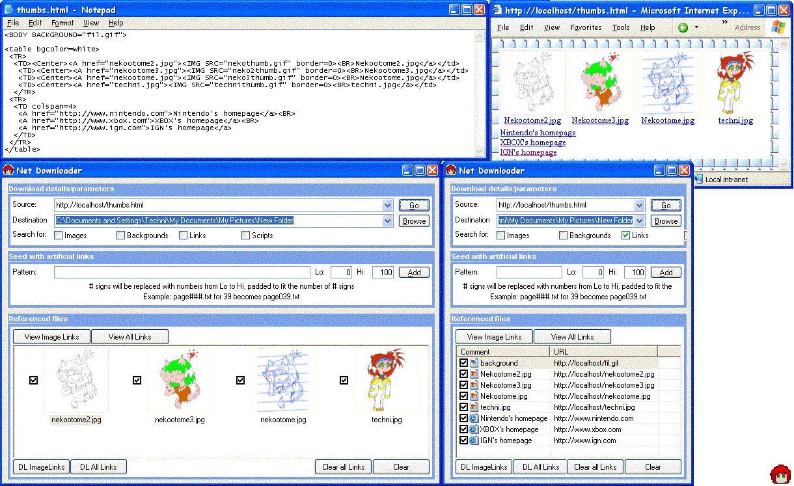



## Net Downloader 3\.5

### Description

Parses HTML to obtain a list of all files referenced. Shows thumbnails used to link to images.

Allows you to select which files you want, then downloads them all.

Similar to my previous NetDownloader programs, but with a much enhanced GUI, the ability to stop downloading the thumbnails, better icon extraction for the file list, keeps a history of destination folders, and obtains a short history list from IE's typed URLs.

Can now seed artificial results like from my first Net Downloader and EZCodes, and the Download All links button actually works this time. (Despite making that claim last time, it does now)

Uses the listview's multiselect feature and a context menu for mass checking/unchecking, no longer hides your selection, and keeps a temporary history of the links you recurse.

Allows manual link recursing by double clicking a link on the 'View all links' list. Automatic recursing was added.

Normally I hate when ppl resubmit their code instead of updating, but this one has so much changed it's almost another program (again)

Added some minor GUI enhancements since posting

Fixed bugs:

Previously all links were labelled as html, with the new icon management, that is not so. When you click a link, it checks if it is html, htm files are not anymore so it didnt recurse, I made it check for different html page types

Fixed the extention checker to account for question marks
 
### More Info
 

             |
---                |---
**Submitted On**   |2004-10-08 12:44:44
**By**             |[Techni Rei Myoko](https://github.com/Planet-Source-Code/PSCIndex/blob/master/ByAuthor/techni-rei-myoko.md)
**Level**          |Advanced
**User Rating**    |5.0 (35 globes from 7 users)
**Compatibility**  |VB 6\.0
**Category**       |[Internet/ HTML](https://github.com/Planet-Source-Code/PSCIndex/blob/master/ByCategory/internet-html__1-34.md)
**World**          |[Visual Basic](https://github.com/Planet-Source-Code/PSCIndex/blob/master/ByWorld/visual-basic.md)
**Archive File**   |[Net\_Downlo1802561082004\.zip](https://github.com/Planet-Source-Code/techni-rei-myoko-net-downloader-3-5__1-51790/archive/master.zip)

